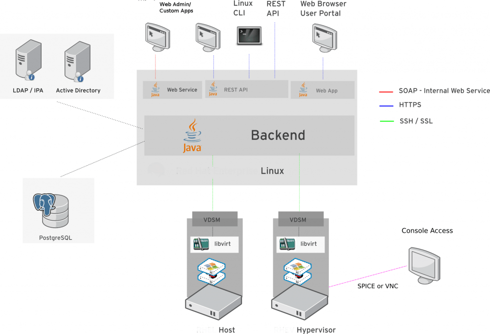
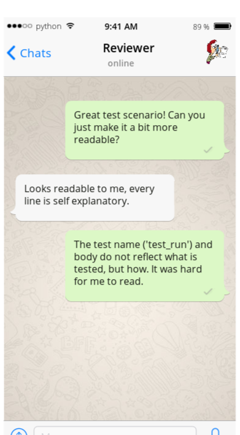

# Beautiful Tests
with pytest


Edward Haas, @redhat <!-- .element: style="position: absolute; left: 0; top: 100%; font-size: 0.6em" -->
edwardh.dev@gmail.com <!-- .element: style="position: absolute; left: 0; top: 120%; font-size: 0.6em" -->

Art: Sveta Haas <!-- .element: style="position: absolute; left: 0; top: 140%; font-size: 0.4em" -->

<!-- .slide: data-background-image="sveta_cats.jpg" data-background-opacity="0.6"-->

---

# oVirt

An open-source distributed virtualization solution,
designed to manage your entire enterprise infrastructure.

--

 

---

# Focus

- Test Requirements & Best Practices
- Beautiful {,test} Code
- Pytest Love

---

# Test Requirements

--

Test Developers <!-- .element: style="font-size: 1.8em" -->

note: Developers with test oriented mindset.
      Requiring the same skills and abilities as any other developer. 

--

Testable Target <!-- .element: style="font-size: 1.8em" -->

note: The target needs a proper API for test automation to access.

--

Tooling <!-- .element: style="font-size: 1.8em" -->

note: Testing framework, CI, HW or Virtual machines.

<!-- .slide: data-background-image="tools.jpg" data-background-opacity="0.6"-->

--

Informative <!-- .element: style="font-size: 1.8em" -->

note: Help pin-point the problem by providing useful information.

--

Maintenance <!-- .element: style="font-size: 1.8em" -->

--

Scale <!-- .element: style="font-size: 1.8em" -->

note: Evolve with the target, increase coverage and test scenarios.

--

Speed <!-- .element: style="font-size: 1.8em" -->

---

# Test Best Practices

--

Fail First <!-- .element: style="font-size: 1.8em" -->

note: Reduce false negatives by confirming a test fails before it passes.

--

Fast before Slow <!-- .element: style="font-size: 1.8em" --> 

<!-- .slide: data-background-image="work_clock.jpg" data-background-opacity="0.4"-->

--

Focused <!-- .element: style="font-size: 1.8em" --> 

note: Small and focused tests are prefered over large scoped ones.
      A test should test one thing, if you cannot name the it well, it is a
      smell of a non focused test.

--

Setup Separation <!-- .element: style="font-size: 1.8em" --> 

note: Separate between the setup and the test itself.
      The setup is an assumption, the test is the uncertainty to check.

--

XFail <!-- .element: style="font-size: 1.8em" -->

- Record a detected bug.
- TDD

--

Reuse Resources <!-- .element: style="font-size: 1.8em" -->

note: When a resource is costly, attemt to reuse it in multiple tests.

--

Continue On Failure <!-- .element: style="font-size: 1.8em" -->

note: Expect tests to fail, stopping on the first failure is not informative
      enough.
      Said that, support leaving the system "freezed" for advance debugging.

<!-- .slide: data-background-image="never_give_up.jpg" data-background-opacity="0.3"-->

--

!Interdependency <!-- .element: style="font-size: 1.8em" -->

note: A test should leave the target in the same state it started of, cleaning
      up after itself. Use fixtures to share resources/state.

--

Readable <!-- .element: style="font-size: 1.8em" -->

Code is being read many more times than being written. <!-- .element: style="font-size: 0.8em" -->

 <!-- .element: style="width: 35%; height: 35%" -->

<!-- .slide: data-background-image="cat_glasses.jpg" data-background-opacity="0.4"-->

note: Supports debugging, maintenance and extendability.

--

Remove Dead Tests <!-- .element: style="font-size: 1.8em" -->

note: Production code has *tests. Tests have only themselves.
      Do not leave unexecuted code, it rots.
      Keep only running tests.

--

!Randomization & Logic <!-- .element: style="font-size: 1.8em" -->

note: Random Testing have their own test category, do not mix them with
      "regular" tests.
      Logic in tests should be limited, it competes with production code and
      may by itself be(come) wrong.

---

# Beautiful Code

--


# Clarity and Transparency

note: Clarity is how easily a reader can deduce what the code does.
      Transparent code does what it seems to do.
      If code seems to do one thing but actually does something else (or something more),
      it's not transparent - it's misleading.

--

<!-- .slide: data-transition="zoom" -->
```python
def test_data_equality():
    row_data1 = [1,2,3]
    row_data2 = copy(row_data1)
    row_data2 = row_data[::-1]
    d1 = Data(row_data1)
    d2 = Data(row_data2)
    assert d1 == d2
```

--

```python
def test_data_equality_ignores_order():
    d1 = Data([1,2,3])
    d2 = Data([3,2,1])
    assert d1 == d2
```

--

# Elegance

```python
def get_max(items):
    max = items[0]
    for i in items:
        if i > max:
            max = i
    return max
```
<!-- .element: class="fragment" data-fragment-index="1" -->

```python
def get_max(items):
    return max(items)
```
<!-- .element: class="fragment" data-fragment-index="2" -->


Note: There are many ways to implement most algorithms, but some ways are
      clumsy while other ways are neat and graceful.

--

# Efficiency

```python
def get_common_items(a, b):
    return [item for item in a if item in b]
```
<!-- .element: class="fragment" data-fragment-index="1" -->

```python
def get_common_items(a, b):
    return list(set(a) & set(b))
```
<!-- .element: class="fragment" data-fragment-index="2" -->

Note: Avoiding unnecessary use of resources (such as CPU time, memory, and I/O).

--

# Reusability & Extendability

- Interfaces
- Dependencies
- Modular & Decoupled code

<!-- .slide: data-background-image="lego_spec.svg" data-background-opacity="0.6"-->

note: Interfaces with modular and decoupled code.

--

# Aesthetics

(use pep8)

Note: Being easy on the eyes (subjective). It mostly comes down to style.
      One important consideration is to have a consistent style.
      *Python* has pep8.

---

# Quiz

--

constants.py

```python
class VMOperState:
    STOP = 'stop'
    RUN = 'run'
    STARTING = 'starting'
 
class NetworkState:
    ABSENT = 'absent'
    UP = 'up'
    DOWN = 'down'
```

Would you ACK or NACK ?

--

Test the Network Connectivity

```python
def test_network():
    net0 = create_network('net0', ...)
    net1 = create_network('net1', ...)
    net0.connect(net1)
    assert net0.ping(net1.ip)
```

Would you ACK or NACK ?

---

# Pytest
The testing framework

- Fixtures            <!-- .element: class="fragment" data-fragment-index="1" -->
<!-- .element: style="color: lime" -->
- Intelligent asserts <!-- .element: class="fragment" data-fragment-index="2" -->
- XFail/Skip          <!-- .element: class="fragment" data-fragment-index="3" -->
<!-- .element: style="color: lime" -->
- Parametrize         <!-- .element: class="fragment" data-fragment-index="4" -->
- Plugins             <!-- .element: class="fragment" data-fragment-index="5" -->
- Fixtures            <!-- .element: class="fragment" data-fragment-index="6" -->
<!-- .element: style="color: lime" -->

--

### Fixture/Definition

```python
@pytest.fixture
def test_setup():
    ret = setup()
    yield ret
    teardown()
```

```python
@pytest.fixture(scope='module')
def module_setup():
    ret = setup()
    return ret
```

```python
@pytest.fixture(scope='session')
def session_setup():
    pass

```

```python
@pytest.fixture(autouse=True)
def auto_test_setup():
    pass
```

--

### Fixture/Usage

```python
def test_fixtures(session_setup, module_setup, test_setup):
    pass
```

--

### Intelligent asserts

```python
def test_me():
    assert {} == {'foo': 0}
    assert 1 == 2
```

--

### XFail

```python
@pytest.mark.xfail(raises=SomeError, strict=True, reason='See BUG#123')
def test_the_bug():
    ...
```

--

### Parametrize

```python
parametrize_color = pytest.mark.parametrize(
    'color', ['red', 'blue'],
    ids=['bridgeless', 'bridged']
)
```

```python
@parametrize_color
def test_colors(color):
    pass
```

---

# Beautiful Test

--

<!-- .slide: data-transition="zoom" -->
```python
def test_vm():
    connection = sdk.Connection(...)
    system = connection.system_service()
    vms_service = system.vms_service()
    vms_service.add(
        types.Vm(name='myvm',
            cluster=types.Cluster(name='mycluster'),
            template=types.Template(name='Blank'))
    )
    vm = vms_service.list(search='name=myvm')[0]
    vm_service = vms_service.vm_service(vm.id)
    vm_service.start()
    # assert stuff on VM
    vm_service.stop()
    connection.close()
```
 <!-- .element: class="fragment" data-fragment-index="1" -->

<!-- .slide: data-background-image="ugly.jpg" data-background-opacity="0.6"-->

--

<!-- .slide: data-transition="none" -->

```python
@pytest.fixture(scope='session', autouse=True)
def connection():
    connection = sdk.Connection(...)
    yield connection
    connection.close()
```

--

```python
@pytest.fixture(scope='module')
def vm0(connection):
    system = connection.system_service()
    vms_service = system.vms_service()
    vms_service.add(
        types.Vm(
            name='myvm',
            cluster=types.Cluster(name='mycluster'),
            template=types.Template(name='Blank'),
        )
    )
    vm = vms_service.list(search='name=myvm')[0]
    vm_service = vms_service.vm_service(vm.id)
    yield vm_service
    vm_service.remove()

--

```python
@pytest.fixture
def vm0_up(vm0):
    vm0.start()
    yield connection
    vm0.stop()
```

```python
def test_vm_is_not_running(vm0):
    # assert stuff on vm0
```

```python
def test_vm_is_running(vm0_up):
    # assert stuff on vm0_up
```

--

All in One

```python
@pytest.fixture
def my_setup():
    with Network.create('net0') as net0:
        with Storage.create('storage0') as storage0:
            with Vm.create('vm0') as vm0:
                with  Vm.create('vm1') as vm1:
                    vm0.run()
                    vm1.run()
                    yield {
                        'vms': [vm0, vm1],
                        'net': net0,
                        'storage': storage0
                    }
def vm_test_something(my_setup):
    # assert stuff
```

--

All in Many

```python
@pytest.fixture
def net0():
    ...
@pytest.fixture
def storage0():
    ...
@pytest.fixture
def vm0():
    ...
@pytest.fixture
def vm1():
    ...

def vm_test_something(net0, storage0, vm0, vm1):
    # assert stuff
```

---

# Thank You

https://ehaas.net/slides/decks/beautiful_test

<!-- .slide: data-background-image="beauty.jpg" data-background-opacity="0.4"-->
